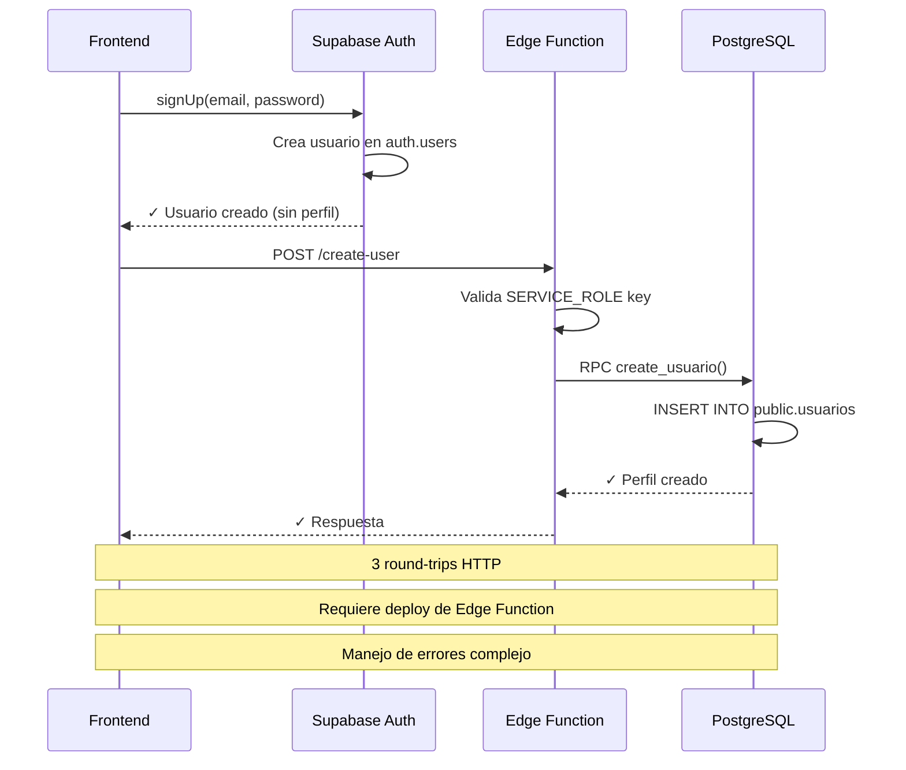
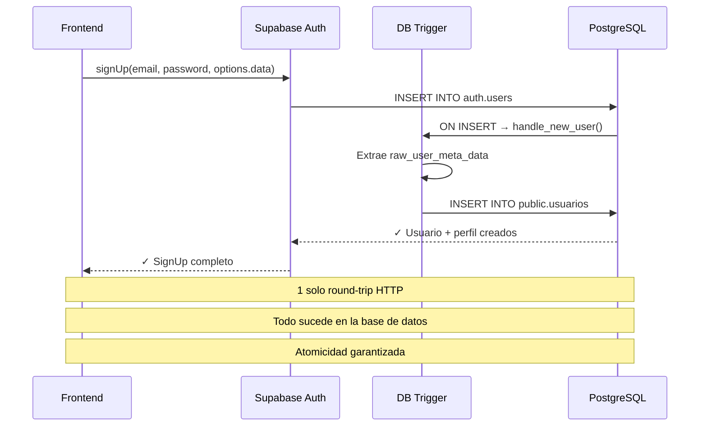

# 🏗️ Cambios en la Arquitectura del Sistema de Registro

## 📊 Comparación: Antes vs. Ahora

### ❌ **ANTES: Con Supabase Functions (Complejo)**



**Problemas**:
- ❌ Requiere desplegar Edge Functions
- ❌ Necesita configurar variables de entorno adicionales (`VITE_CREATE_USER_URL`)
- ❌ 3 llamadas HTTP separadas
- ❌ Latencia mayor (RTT múltiples)
- ❌ Más código para mantener (frontend + function + RPC)
- ❌ Manejo de errores en múltiples capas
- ❌ Posibilidad de inconsistencia si falla algún paso

---

### ✅ **AHORA: Con Trigger Automático (Simple)**



**Ventajas**:
- ✅ **1 sola llamada HTTP** (signUp)
- ✅ **Sin Edge Functions** necesarias
- ✅ **Sin variables de entorno extras**
- ✅ **Atomicidad** (transacción única en PostgreSQL)
- ✅ **Latencia mínima** (todo en DB)
- ✅ **Código más simple** (menos capas)
- ✅ **Relación 1:1 garantizada** (mismo ID en ambas tablas)
- ✅ **Menos superficie de ataque** (sin endpoints externos)

---

## 📁 Archivos Modificados

### ✏️ Archivos Editados

| Archivo | Cambios |
|---------|---------|
| `supabase_seed.sql` | ✅ Agregado trigger `handle_new_user()` |
| `web/src/lib/auth.ts` | ✅ Simplificada función `registerUser()` |
| `web/src/pages/Register.tsx` | ✅ Actualizados mensajes de error |
| `web/.env.example` | ✅ Removidas variables obsoletas |
| `README.md` | ✅ Documentación actualizada |

### 📄 Archivos Nuevos

| Archivo | Propósito |
|---------|-----------|
| `REGISTRO_AUTOMATICO.md` | 📚 Documentación completa del sistema |
| `test_trigger.sql` | 🧪 Script de pruebas del trigger |
| `TROUBLESHOOTING.md` | 🔧 Guía de resolución de problemas |
| `ARQUITECTURA_CAMBIOS.md` | 🏗️ Este archivo (comparación antes/después) |

### 🗑️ Archivos que podés eliminar

| Archivo/Carpeta | Razón |
|-----------------|-------|
| `supabase-functions/` | ❌ Ya no es necesaria |
| `.env` variables `VITE_CREATE_USER_URL` | ❌ No se usa más |
| `.env` variables `VITE_ADMIN_*` | ❌ No se usa más |

---

## 🔄 Flujo de Datos: Comparación Detallada

### ANTES (Complejo - 7 pasos)

```
1. Frontend: supabase.auth.signUp()
   ↓
2. Supabase: Crea usuario en auth.users
   ↓
3. Frontend: Recibe respuesta (usuario sin perfil)
   ↓
4. Frontend: fetch(VITE_CREATE_USER_URL, { userId, ... })
   ↓
5. Edge Function: Valida SERVICE_ROLE key
   ↓
6. Edge Function: supabaseAdmin.rpc('create_usuario', {...})
   ↓
7. PostgreSQL: INSERT INTO public.usuarios
```

**Tiempo estimado**: 500-1500ms (3 round-trips)

---

### AHORA (Simple - 3 pasos)

```
1. Frontend: supabase.auth.signUp({ options: { data: {...} } })
   ↓
2. PostgreSQL: Trigger handle_new_user() se ejecuta automáticamente
   ↓
3. PostgreSQL: INSERT INTO public.usuarios (mismo ID que auth.users)
```

**Tiempo estimado**: 150-400ms (1 round-trip)

**Mejora de performance**: ~3x más rápido ⚡

---

## 🔐 Seguridad: Comparación

### ANTES
- ✅ SERVICE_ROLE key en Edge Function (servidor)
- ❌ Necesita endpoint público expuesto
- ❌ Validación de autenticación en múltiples capas
- ⚠️ Posible ataque si el endpoint se expone mal

### AHORA
- ✅ Trigger con `SECURITY DEFINER` (privilegios controlados)
- ✅ Sin endpoints públicos
- ✅ Todo dentro de PostgreSQL (superficie de ataque mínima)
- ✅ Validaciones en un solo lugar (función del trigger)

**Resultado**: Más seguro y más simple 🔒

---

## 💰 Costos: Comparación

### ANTES
- Edge Functions: Incluidas en free tier (pero hay límites)
- Invocaciones: 500k/mes gratis, luego $2 por millón
- Si superás el free tier: costos adicionales

### AHORA
- Triggers: Incluidos en el costo base de PostgreSQL
- Sin invocaciones HTTP adicionales
- Sin límites de invocaciones (es parte de las queries SQL normales)

**Resultado**: Menor costo a escala 💵

---

## 📈 Escalabilidad: Comparación

### ANTES
| Usuarios/mes | Edge Functions Calls | Costo estimado |
|--------------|---------------------|----------------|
| 100          | 100                 | $0 (free tier) |
| 1,000        | 1,000               | $0 (free tier) |
| 10,000       | 10,000              | $0 (free tier) |
| 100,000      | 100,000             | $0 (free tier) |
| 1,000,000    | 1,000,000           | ~$2            |

### AHORA
| Usuarios/mes | Triggers | Costo estimado |
|--------------|----------|----------------|
| 100          | 100      | $0             |
| 1,000        | 1,000    | $0             |
| 10,000       | 10,000   | $0             |
| 100,000      | 100,000  | $0             |
| 1,000,000    | 1,000,000| $0             |

**Resultado**: Costo predecible y menor 📊

---

## 🧪 Testing: Comparación

### ANTES
- Necesitás probar:
  - Frontend (signUp)
  - Edge Function (deploy + test)
  - RPC (create_usuario)
  - Integración completa
- Environment: Local + Staging + Production
- Complejidad: Alta

### AHORA
- Necesitás probar:
  - Frontend (signUp)
  - Trigger (test_trigger.sql)
- Environment: SQL Editor (único lugar)
- Complejidad: Baja

**Resultado**: Testing más simple y rápido 🧪

---

## 📦 Deployment: Comparación

### ANTES
```bash
# 1. Deploy Edge Function
supabase functions deploy create-user

# 2. Configurar secrets
supabase secrets set SERVICE_ROLE_KEY=...

# 3. Configurar frontend
VITE_CREATE_USER_URL=https://...functions.supabase.co/create-user

# 4. Deploy frontend
vercel --prod
```

**Pasos**: 4 | **Complejidad**: Media-Alta

### AHORA
```bash
# 1. Ejecutar seed en Supabase SQL Editor
# (copiar/pegar supabase_seed.sql)

# 2. Deploy frontend
vercel --prod
```

**Pasos**: 2 | **Complejidad**: Baja

**Resultado**: Deploy más simple y rápido 🚀

---

## 🎯 Resumen Ejecutivo

| Aspecto | Antes (Edge Functions) | Ahora (Trigger) | Ganancia |
|---------|------------------------|-----------------|----------|
| **Complejidad** | Alta (3 componentes) | Baja (1 componente) | ⭐⭐⭐⭐⭐ |
| **Performance** | 500-1500ms | 150-400ms | ⚡ 3x más rápido |
| **Costos** | Variable (escala) | Fijo ($0) | 💰 Menor |
| **Seguridad** | Media (endpoint público) | Alta (todo en DB) | 🔒 Más seguro |
| **Mantenimiento** | 3 archivos | 1 archivo | 🛠️ Menos código |
| **Testing** | Complejo | Simple | ✅ Más fácil |
| **Deploy** | 4 pasos | 2 pasos | 🚀 Más rápido |
| **Debugging** | Multi-capa | Single-layer | 🐛 Más fácil |

---

## 🎉 Conclusión

La migración de Edge Functions a Triggers de PostgreSQL representa:

✅ **Simplificación arquitectónica significativa**  
✅ **Mejora de performance (3x más rápido)**  
✅ **Reducción de costos a escala**  
✅ **Mayor seguridad**  
✅ **Código más mantenible**  
✅ **Testing más simple**  
✅ **Deploy más rápido**  

**Sin sacrificar funcionalidad** 🎯

---

## 🚀 Próximos Pasos

1. ✅ Ejecutar `supabase_seed.sql` en Supabase SQL Editor
2. ✅ Probar el registro desde el frontend
3. ✅ Ejecutar `test_trigger.sql` para validar
4. ✅ Eliminar carpeta `supabase-functions/` (ya no es necesaria)
5. ✅ Limpiar variables de entorno obsoletas
6. ✅ Deploy a producción

¿Dudas? Consultá:
- 📚 `REGISTRO_AUTOMATICO.md` (documentación completa)
- 🔧 `TROUBLESHOOTING.md` (resolución de problemas)
- 🧪 `test_trigger.sql` (scripts de prueba)
