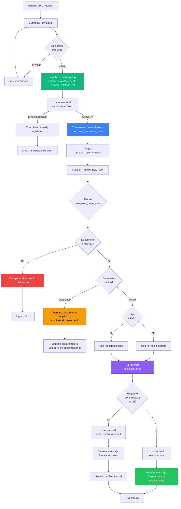
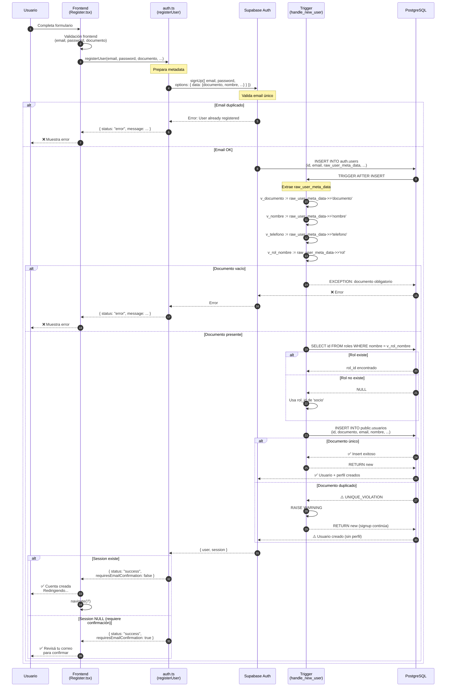
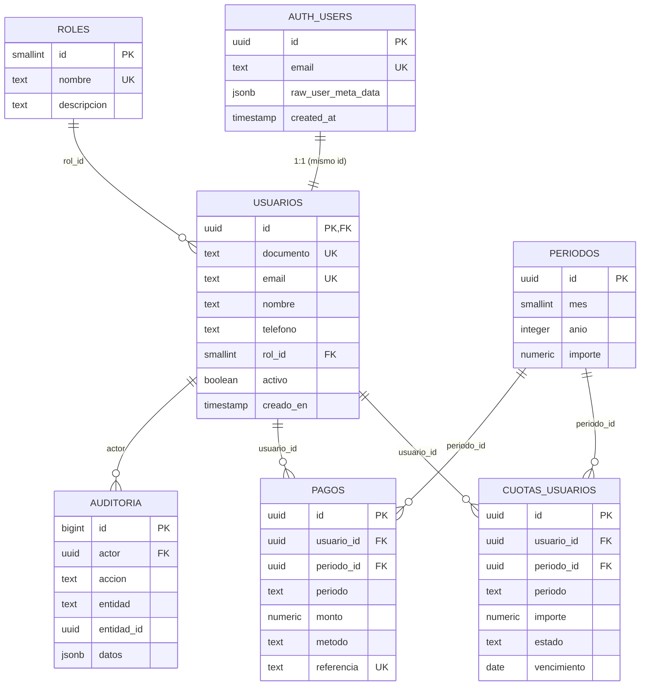
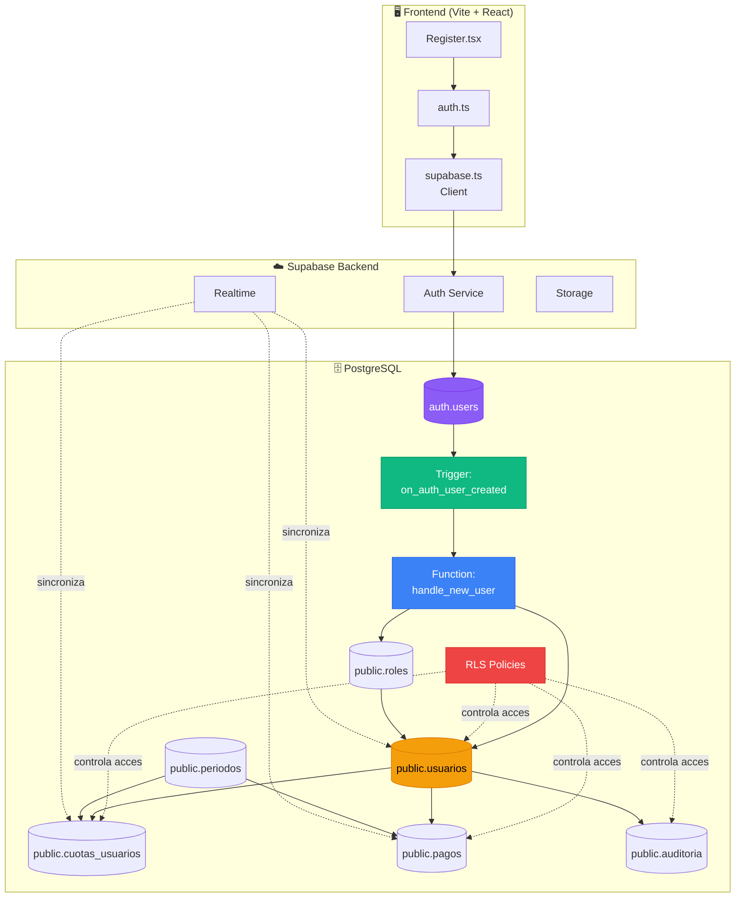
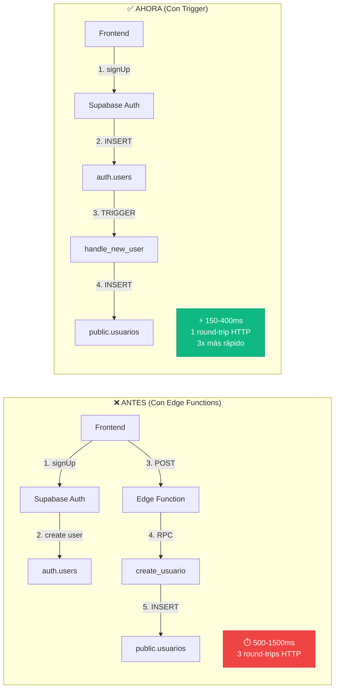
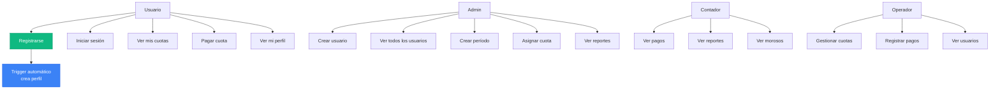

# 🎨 Diagramas del Sistema de Registro Automático

## 📊 Diagrama de Flujo Completo

## 🔄 Diagrama de Secuencia Detallado

## 🗄️ Diagrama de Base de Datos (Relaciones)

## 🏗️ Diagrama de Arquitectura del Sistema

## 🔐 Diagrama de Seguridad y RLS

```mermaid
graph TD
    subgraph Roles["👥 Roles del Sistema"]
        ADMIN[Admin<br/>Acceso total]
        CONTADOR[Contador<br/>Reportes + Pagos]
        OPERADOR[Operador<br/>Gestión operativa]
        SOCIO[Socio<br/>Datos propios]
    end

    subgraph Policies["🛡️ RLS Policies"]
        P1[usuarios_select_self<br/>Usuario lee su registro]
        P2[usuarios_update_self<br/>Usuario actualiza su registro]
        P3[usuarios_select_admin<br/>Admin/Contador/Operador<br/>leen todos]
        P4[usuarios_insert_admin<br/>Solo Admin inserta]
        P5[usuarios_update_admin<br/>Solo Admin actualiza todos]
        
        P6[cuotas_read_self_or_admin<br/>Usuario lee sus cuotas<br/>o roles elevados todas]
        P7[cuotas_insert_admin<br/>Admin/Contador/Operador<br/>crean cuotas]
        
        P8[pagos_read_self_or_admin<br/>Usuario lee sus pagos<br/>o roles elevados todos]
        P9[pagos_insert_self_or_admin<br/>Usuario registra su pago<br/>o roles elevados]
    end

    subgraph Tables["📊 Tablas"]
        TU[public.usuarios]
        TC[public.cuotas_usuarios]
        TP[public.pagos]
        TA[public.auditoria]
    end

    ADMIN --> P3
    ADMIN --> P4
    ADMIN --> P5
    ADMIN --> P7
    ADMIN --> P8
    ADMIN --> P9
    
    CONTADOR --> P3
    CONTADOR --> P7
    CONTADOR --> P8
    CONTADOR --> P9
    
    OPERADOR --> P3
    OPERADOR --> P7
    OPERADOR --> P8
    OPERADOR --> P9
    
    SOCIO --> P1
    SOCIO --> P2
    SOCIO --> P6
    SOCIO --> P8
    SOCIO --> P9
    
    P1 --> TU
    P2 --> TU
    P3 --> TU
    P4 --> TU
    P5 --> TU
    
    P6 --> TC
    P7 --> TC
    
    P8 --> TP
    P9 --> TP

    style ADMIN fill:#ef4444,stroke:#dc2626,color:#fff
    style CONTADOR fill:#3b82f6,stroke:#2563eb,color:#fff
    style OPERADOR fill:#8b5cf6,stroke:#7c3aed,color:#fff
    style SOCIO fill:#10b981,stroke:#059669,color:#fff
```

## 📈 Diagrama de Performance Comparison

## 🎯 Diagrama de Casos de Uso

---

## 📝 Leyenda de Colores

- 🟢 **Verde** (#10b981): Trigger y operaciones exitosas
- 🔵 **Azul** (#3b82f6): Funciones y procesos internos
- 🟣 **Morado** (#8b5cf6): Base de datos y tablas
- 🟡 **Amarillo** (#f59e0b): Datos y entidades
- 🔴 **Rojo** (#ef4444): Errores y políticas de seguridad

---

## 💡 Uso de estos Diagramas

Estos diagramas podés:

1. **Incluirlos en documentación técnica**
2. **Presentarlos en reuniones de equipo**
3. **Usarlos para onboarding de nuevos devs**
4. **Referenciarlos durante troubleshooting**
5. **Exportarlos como imágenes** (Mermaid Live Editor)

Para renderizar estos diagramas:
- GitHub los muestra automáticamente en archivos .md
- VS Code: instalar extensión "Markdown Preview Mermaid Support"
- Online: https://mermaid.live/

---

¡Estos diagramas te ayudarán a visualizar y explicar el sistema completo! 🎨
