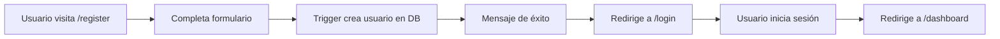
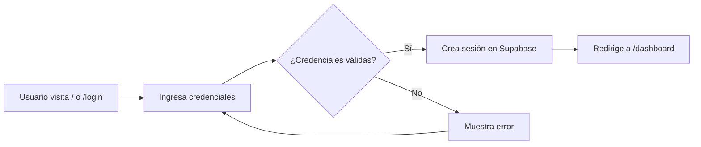
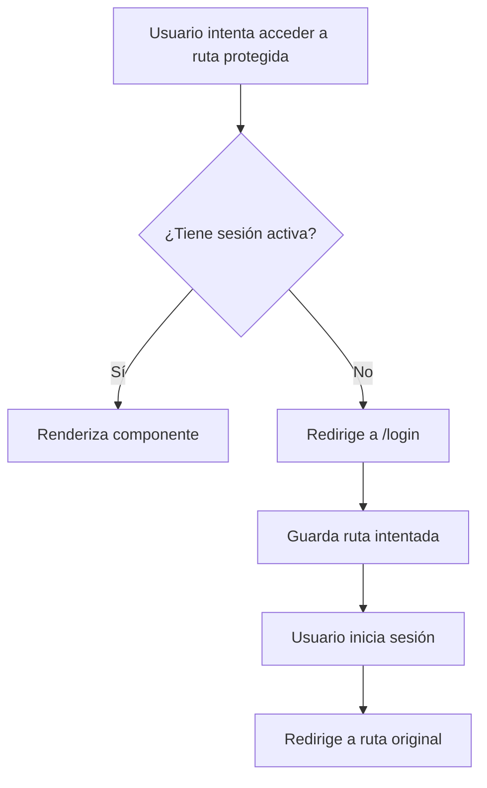
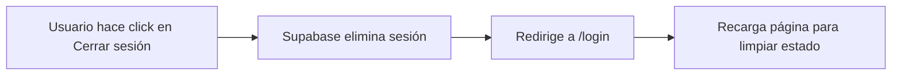

# 🔐 Sistema de Navegación y Autenticación

## 📋 Resumen

Este documento describe el flujo de autenticación y navegación implementado en la aplicación Hamburg Club.

## 🎯 Objetivos Implementados

1. ✅ **Login como página principal** (`/` redirige a `/login`)
2. ✅ **Rutas protegidas** que requieren autenticación
3. ✅ **Flujo de registro** → Login → Dashboard
4. ✅ **Dashboard como home** para usuarios autenticados

---

## 🗺️ Mapa de Rutas

### Rutas Públicas (sin autenticación)

| Ruta | Componente | Descripción |
|------|------------|-------------|
| `/` | `Login` | Página principal - redirige al login |
| `/login` | `Login` | Inicio de sesión |
| `/register` | `Register` | Registro de nuevos usuarios |

### Rutas Protegidas (requieren autenticación)

| Ruta | Componente | Descripción |
|------|------------|-------------|
| `/dashboard` | `Home` | Panel principal con estadísticas |
| `/socios` | `Members` | Gestión de socios |
| `/cuotas` | `Dues` | Gestión de cuotas |
| `/pagos` | `Payments` | Gestión de pagos |
| `/reportes` | `Reports` | Reportes del sistema |
| `/admin/create-user` | `AdminCreateUser` | Creación de usuarios (solo admin) |

---

## 🔄 Flujos de Usuario

### 1️⃣ Flujo de Registro



**Pasos:**
1. Usuario accede a `/register`
2. Completa el formulario (nombre, email, documento, contraseña)
3. Sistema registra usuario (trigger automático crea perfil en `public.usuarios`)
4. Mensaje: "Cuenta creada con éxito. Te redirigimos al login..."
5. Redirección automática a `/login` en 2 segundos
6. Usuario debe iniciar sesión para acceder al dashboard

### 2️⃣ Flujo de Login



**Pasos:**
1. Usuario accede a `/` o `/login`
2. Ingresa email y contraseña
3. Supabase valida credenciales
4. Si es exitoso: redirige a `/dashboard`
5. Si falla: muestra mensaje de error

### 3️⃣ Flujo de Navegación Protegida



**Características:**
- Si el usuario NO está autenticado, redirige a `/login`
- Guarda la ruta que intentó acceder
- Después del login exitoso, lo lleva a esa ruta (o `/dashboard` por defecto)
- Mientras carga la sesión, muestra un loader

### 4️⃣ Flujo de Logout



---

## 🛠️ Componentes Técnicos

### 1. `ProtectedRoute`

Componente wrapper que protege rutas que requieren autenticación.

**Ubicación:** `web/src/components/ProtectedRoute.tsx`

```typescript
export function ProtectedRoute({ children }: ProtectedRouteProps) {
  const { session, isLoading } = useAuthenticatedUser();
  const location = useLocation();

  // Mientras carga: mostrar loader
  if (isLoading) {
    return <Loader />;
  }

  // Sin sesión: redirigir a login
  if (!session) {
    return <Navigate to="/login" state={{ from: location }} replace />;
  }

  // Con sesión: renderizar contenido
  return <>{children}</>;
}
```

**Características:**
- ✅ Usa `useAuthenticatedUser()` para verificar sesión
- ✅ Muestra `<Loader />` mientras carga
- ✅ Redirige a `/login` si no hay sesión
- ✅ Guarda la ubicación original en `state`

### 2. Configuración de Rutas

**Ubicación:** `web/src/routes.tsx`

```typescript
export type AppRoute = {
  path: string;
  Component: ComponentType;
  layout?: "default" | "plain";
  protected?: boolean;  // ← Nueva propiedad
};

const routes: AppRoute[] = [
  // Públicas
  { path: "/", Component: LoginPage, layout: "plain" },
  { path: "/login", Component: LoginPage, layout: "plain" },
  { path: "/register", Component: RegisterPage, layout: "plain" },
  
  // Protegidas
  { path: "/dashboard", Component: HomePage, protected: true },
  { path: "/socios", Component: MembersPage, protected: true },
  // ... más rutas
];
```

**Propiedad `protected`:**
- `true`: Ruta requiere autenticación
- `false` o `undefined`: Ruta pública

### 3. App Router

**Ubicación:** `web/src/App.tsx`

```typescript
function App() {
  return (
    <Routes>
      {routes.map(({ path, Component, layout, protected: isProtected }) => {
        const element = (
          <Suspense fallback={<Loader />}>
            <Component />
          </Suspense>
        );

        // Si es protegida, envolver en ProtectedRoute
        if (isProtected) {
          const protectedElement = <ProtectedRoute>{element}</ProtectedRoute>;
          
          return layout === "plain" 
            ? <Route key={path} path={path} element={protectedElement} />
            : <Route key={path} path={path} element={<Layout>{protectedElement}</Layout>} />;
        }

        // Ruta pública
        return layout === "plain"
          ? <Route key={path} path={path} element={element} />
          : <Route key={path} path={path} element={<Layout>{element}</Layout>} />
      })}
    </Routes>
  );
}
```

---

## 🔑 Hook de Autenticación

**Ubicación:** `web/src/hooks/useAuthenticatedUser.ts`

```typescript
export function useAuthenticatedUser() {
  const [session, setSession] = useState<Session | null>(null);
  const [isLoading, setIsLoading] = useState(true);

  useEffect(() => {
    // Obtener sesión inicial
    supabase.auth.getSession().then(({ data }) => {
      setSession(data.session ?? null);
      setIsLoading(false);
    });

    // Escuchar cambios de autenticación
    const { data: subscription } = supabase.auth.onAuthStateChange((_event, newSession) => {
      setSession(newSession);
    });

    return () => {
      subscription.subscription?.unsubscribe();
    };
  }, []);

  return { session, isLoading };
}
```

**Retorna:**
- `session`: Objeto de sesión de Supabase (o `null`)
- `isLoading`: `true` mientras carga la sesión inicial

---

## 📝 Cambios en Componentes

### Login (`web/src/pages/Login.tsx`)

**Antes:**
- Redirigía a `/` después del login

**Ahora:**
- Redirige a `/dashboard` después del login
- Si venía de otra ruta protegida, vuelve ahí
- Si ya está logueado, muestra botón "Ir al dashboard"

```typescript
const handleSubmit = async (e: React.FormEvent) => {
  // ... validación
  
  const { data, error } = await supabase.auth.signInWithPassword({ email, password });
  
  if (error) {
    setError(error.message);
    return;
  }

  // Redirigir a la ruta intentada o al dashboard
  const from = (location.state as any)?.from?.pathname || "/dashboard";
  navigate(from, { replace: true });
};
```

### Register (`web/src/pages/Register.tsx`)

**Antes:**
- Botón "Volver" llevaba a `/`
- Después del registro redirigía a `/`
- Mensaje decía "ingresá desde el panel principal"

**Ahora:**
- Botón "Volver" lleva a `/login`
- Después del registro redirige a `/login`
- Link directo "Iniciá sesión" al final del formulario
- Mensaje: "Cuenta creada con éxito. Te redirigimos al login..."

```typescript
const handleBackHome = () => {
  navigate("/login", { replace: true });
};

const handleSubmit = async (event: FormEvent<HTMLFormElement>) => {
  // ... registro
  
  if (response.status === "success") {
    setFeedback({
      type: "success",
      message: "Cuenta creada con éxito. Te redirigimos al login...",
    });

    window.setTimeout(() => {
      navigate("/login", { replace: true });
    }, 2000);
  }
};
```

### Layout (`web/src/components/Layout.tsx`)

**Cambios en navegación:**
- Menú "Resumen" apunta a `/dashboard` (antes `/`)

**Cambios en logout:**
- Redirige a `/login` (antes `/`)

```typescript
const navigation = [
  { to: "/dashboard", label: "Resumen" },  // ← Cambió de "/"
  { to: "/socios", label: "Socios" },
  { to: "/cuotas", label: "Cuotas" },
  { to: "/pagos", label: "Pagos" },
  { to: "/reportes", label: "Reportes" },
];

function LogoutButton() {
  const handleLogout = async () => {
    await supabase.auth.signOut();
    navigate("/login", { replace: true });  // ← Cambió de "/"
    window.location.reload();
  };
  // ...
}
```

---

## 🧪 Testing Manual

### Test 1: Usuario No Autenticado

1. Abrir navegador en modo incógnito
2. Ir a `http://localhost:3002/`
3. ✅ **Esperado:** Redirige a `/login`
4. Intentar acceder a `http://localhost:3002/dashboard`
5. ✅ **Esperado:** Redirige a `/login`

### Test 2: Flujo de Registro

1. En `/login`, hacer click en "Registrate"
2. Completar formulario de registro
3. ✅ **Esperado:** Mensaje "Cuenta creada con éxito"
4. ✅ **Esperado:** Redirige a `/login` en 2 segundos
5. Iniciar sesión con las credenciales creadas
6. ✅ **Esperado:** Redirige a `/dashboard`

### Test 3: Navegación Protegida

1. Intentar acceder a `/socios` sin autenticación
2. ✅ **Esperado:** Redirige a `/login`
3. Iniciar sesión
4. ✅ **Esperado:** Redirige a `/socios` (ruta original intentada)

### Test 4: Logout

1. Estando autenticado en `/dashboard`
2. Click en "Cerrar sesión"
3. ✅ **Esperado:** Redirige a `/login`
4. ✅ **Esperado:** Página recarga (limpia estado)
5. Intentar acceder a `/dashboard`
6. ✅ **Esperado:** Redirige a `/login`

---

## 🎨 Próximos Pasos (RBAC)

### Implementación Futura: Rutas por Rol

Actualmente todas las rutas protegidas son accesibles para cualquier usuario autenticado. El siguiente paso es implementar **control de acceso basado en roles (RBAC)**.

#### Ejemplo de configuración futura:

```typescript
const routes: AppRoute[] = [
  // Protegidas - todos los roles autenticados
  { 
    path: "/dashboard", 
    Component: HomePage, 
    protected: true 
  },
  
  // Protegidas - solo admin y contador
  { 
    path: "/reportes", 
    Component: ReportsPage, 
    protected: true,
    allowedRoles: ["admin", "contador"]  // ← Nueva propiedad
  },
  
  // Protegidas - solo admin
  { 
    path: "/admin/create-user", 
    Component: AdminCreateUser, 
    protected: true,
    allowedRoles: ["admin"]
  },
];
```

#### Componente `RoleProtectedRoute`:

```typescript
export function RoleProtectedRoute({ 
  children, 
  allowedRoles 
}: RoleProtectedRouteProps) {
  const { session, isLoading } = useAuthenticatedUser();
  const [userRole, setUserRole] = useState<string | null>(null);

  useEffect(() => {
    if (session) {
      // Obtener rol del usuario desde public.usuarios
      const fetchUserRole = async () => {
        const { data } = await supabase
          .from('usuarios')
          .select('rol:roles(nombre)')
          .eq('id', session.user.id)
          .single();
        
        setUserRole(data?.rol?.nombre ?? 'socio');
      };
      fetchUserRole();
    }
  }, [session]);

  if (isLoading) return <Loader />;
  if (!session) return <Navigate to="/login" replace />;
  
  // Verificar si el rol está permitido
  if (allowedRoles && !allowedRoles.includes(userRole ?? '')) {
    return <Navigate to="/dashboard" replace />;
  }

  return <>{children}</>;
}
```

---

## 📚 Referencias

- **Trigger de Registro:** `docs/REGISTRO_AUTOMATICO.md`
- **Arquitectura:** `docs/ARQUITECTURA_CAMBIOS.md`
- **RBAC Actual:** `web/src/lib/rbac.ts`
- **Guía de Desarrollo:** `reglas/dev-frontend.txt`

---

## 🔍 Troubleshooting

### Problema: Loop infinito en redirecciones

**Causa:** `ProtectedRoute` redirige a `/login`, pero `/login` también está protegido.

**Solución:** Verificar que `/login` y `/register` tengan `protected: false` o `undefined`.

### Problema: Usuario logueado ve el login

**Causa:** `useAuthenticatedUser` no está detectando la sesión.

**Solución:** 
1. Verificar que Supabase está inicializado correctamente
2. Revisar consola del navegador por errores
3. Verificar que `VITE_SUPABASE_URL` y `VITE_SUPABASE_ANON_KEY` están en `.env`

### Problema: Después del registro no redirige

**Causa:** `setTimeout` puede estar siendo cancelado.

**Solución:** Verificar que el componente no se desmonta antes de los 2 segundos.

---

**Documentación actualizada:** 2025-10-25  
**Autor:** Sistema de Documentación Automática
