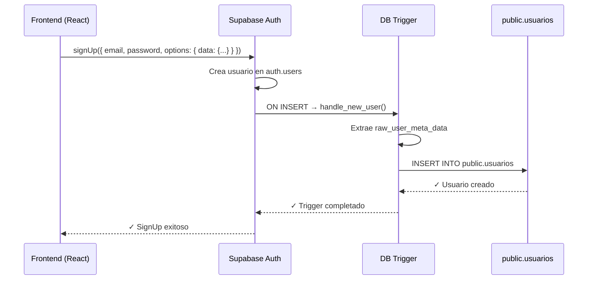

# 🔐 Sistema de Registro Automático (Auth + DB)

## 📋 Resumen

El sistema ahora utiliza un **trigger automático en PostgreSQL** que sincroniza `auth.users` con `public.usuarios` en una relación **1:1**, eliminando la necesidad de Edge Functions o backend adicional.

## 🔄 Flujo Completo


```mermaid
sequenceDiagram
    participant Cliente as Frontend (React)
    participant Auth as Supabase Auth
    participant Trigger as DB Trigger
    participant DB as public.usuarios

    Cliente->>Auth: signUp({ email, password, options: { data: {...} } })
    Auth->>Auth: Crea usuario en auth.users
    Auth->>Trigger: ON INSERT → handle_new_user()
    Trigger->>Trigger: Extrae raw_user_meta_data
    Trigger->>DB: INSERT INTO public.usuarios
    DB-->>Trigger: ✓ Usuario creado
    Trigger-->>Auth: ✓ Trigger completado
    Auth-->>Cliente: ✓ SignUp exitoso
```

## 🛠️ Componentes del Sistema

### 1. **Trigger de Base de Datos** (`supabase_seed.sql`)

```sql
create or replace function public.handle_new_user()
returns trigger
language plpgsql
security definer
set search_path = public, auth
as $$
declare
  v_rol_id smallint;
  v_rol_nombre text;
  v_documento text;
  v_nombre text;
  v_telefono text;
begin
  -- Extraer metadata del signup
  v_documento := coalesce(new.raw_user_meta_data->>'documento', '');
  v_nombre := coalesce(new.raw_user_meta_data->>'nombre', new.email);
  v_telefono := new.raw_user_meta_data->>'telefono';
  v_rol_nombre := coalesce(new.raw_user_meta_data->>'rol', 'socio');

  -- Validación documento obligatorio
  if v_documento = '' then
    raise exception 'El documento es obligatorio en raw_user_meta_data';
  end if;

  -- Obtener rol_id (default: socio)
  select id into v_rol_id 
  from public.roles 
  where nombre = v_rol_nombre;
  
  if v_rol_id is null then
    select id into v_rol_id 
    from public.roles 
    where nombre = 'socio';
  end if;

  -- Insertar en public.usuarios (1:1 con auth.users)
  insert into public.usuarios (
    id, documento, email, nombre, telefono, rol_id, activo, creado_en, actualizado_en
  )
  values (
    new.id, v_documento, new.email, v_nombre, v_telefono, v_rol_id, true, now(), now()
  );

  return new;
exception
  when unique_violation then
    raise warning 'Documento % ya existe para otro usuario', v_documento;
    return new;
  when others then
    raise warning 'Error creando usuario en public.usuarios: %', sqlerrm;
    return new;
end;
$$;

-- Activar el trigger
create trigger on_auth_user_created
  after insert on auth.users
  for each row execute function public.handle_new_user();
```

### 2. **Función Frontend** (`web/src/lib/auth.ts`)

```typescript
export const registerUser = async ({
  fullName,
  email,
  password,
  document,
  phone,
  role,
}: RegisterPayload): Promise<RegisterResponse> => {
  const trimmedEmail = email.trim().toLowerCase();
  const trimmedDocument = document.trim();
  const trimmedPhone = phone?.trim();

  // Crear usuario en Supabase Auth con metadata
  const { data: signUpData, error: signUpError } = await supabase.auth.signUp({
    email: trimmedEmail,
    password,
    options: {
      data: {
        // Datos que el trigger extraerá
        documento: trimmedDocument,
        nombre: fullName,
        telefono: trimmedPhone || null,
        rol: role,
      },
    },
  });

  if (signUpError) {
    return { status: "error", message: signUpError.message };
  }

  // El trigger ya creó automáticamente el registro en public.usuarios
  return {
    status: "success",
    requiresEmailConfirmation: !signUpData.session,
  };
};
```

### 3. **Componente de Registro** (`web/src/pages/Register.tsx`)

El componente solo necesita llamar a `registerUser()` con los datos del formulario. El trigger se encarga del resto:

```typescript
const handleSubmit = async (event: FormEvent<HTMLFormElement>) => {
  event.preventDefault();

  const response = await registerUser({
    fullName: formState.fullName.trim(),
    email: formState.email.trim(),
    password: formState.password,
    document: formState.document.trim(),
    phone: formState.phone.trim() || undefined,
    role: 'socio', // registro público siempre crea socios
  });

  if (response.status === "error") {
    setFeedback({ type: "error", message: getFriendlyError(response.message) });
    return;
  }

  // Usuario creado exitosamente (trigger ya procesó todo)
  setFeedback({
    type: "success",
    message: response.requiresEmailConfirmation
      ? "¡Listo! Revisá tu correo para confirmar la cuenta."
      : "Cuenta creada con éxito. Te redirigimos...",
  });
};
```

## ✅ Ventajas de Esta Arquitectura

1. **✨ Simplicidad**: Sin necesidad de Edge Functions, Next.js o backend custom
2. **🔒 Seguridad**: El trigger usa `SECURITY DEFINER` con privilegios controlados
3. **⚡ Performance**: Todo sucede en la base de datos (sin round-trips HTTP)
4. **🎯 Atomicidad**: Usuario de auth + perfil en DB se crean en una sola transacción
5. **🛡️ Validaciones**: Documento único, email único, rol válido
6. **📊 Auditoría**: Todos los cambios quedan registrados en PostgreSQL logs
7. **🧪 Testing**: Fácil de probar directamente en Supabase SQL Editor

## 🔐 Datos Enviados en el Registro

Cuando el frontend llama `supabase.auth.signUp()`, envía:

```javascript
{
  email: 'usuario@example.com',
  password: 'password123',
  options: {
    data: {
      documento: '12345678',      // ← El trigger lo extrae
      nombre: 'Juan Pérez',       // ← El trigger lo extrae
      telefono: '+5491123456789', // ← El trigger lo extrae (opcional)
      rol: 'socio'                // ← El trigger lo extrae (default: 'socio')
    }
  }
}
```

Estos datos quedan almacenados en `auth.users.raw_user_meta_data` y el trigger los procesa automáticamente.

## 🧪 Cómo Probar

### 1. Ejecutar el seed en Supabase

1. Abrí el **SQL Editor** en tu dashboard de Supabase
2. Copiá y pegá todo el contenido de `supabase_seed.sql`
3. Ejecutá el script (esto crea tablas, trigger, políticas, etc.)

### 2. Probar desde el frontend

```bash
cd web
npm run dev
```

1. Navegá a `/register`
2. Completá el formulario con:
   - Nombre completo
   - Email único
   - Documento único (mínimo 6 caracteres)
   - Teléfono (opcional)
   - Contraseña (mínimo 8 caracteres)
3. Hacé clic en "Crear cuenta"

### 3. Verificar en Supabase

#### Verificar auth.users:
```sql
select id, email, raw_user_meta_data 
from auth.users 
order by created_at desc 
limit 1;
```

#### Verificar public.usuarios:
```sql
select id, documento, email, nombre, telefono, rol_id 
from public.usuarios 
order by creado_en desc 
limit 1;
```

Ambos registros deben tener el **mismo `id`** (UUID).

## 🐛 Manejo de Errores

El trigger maneja errores gracefully:

| Error | Comportamiento |
|-------|----------------|
| Documento vacío | Lanza excepción (signup falla) |
| Documento duplicado | Loguea warning (signup continúa) |
| Email duplicado | Supabase Auth lo rechaza automáticamente |
| Rol inválido | Usa 'socio' por defecto |
| Otros errores | Loguea warning (signup continúa) |

## 📝 Notas Importantes

1. **El trigger NO falla el signup**: Si hay errores al crear `public.usuarios` (ej: documento duplicado), el usuario igual se crea en `auth.users` pero se loguea un warning.

2. **Documento es obligatorio**: Si no enviás `documento` en `raw_user_meta_data`, el trigger lanzará una excepción y el signup fallará.

3. **Rol por defecto**: Si no especificás `rol` o el rol no existe, se usa 'socio' automáticamente.

4. **Confirmación de email**: Si Supabase está configurado para requerir confirmación de email, el trigger igual crea el perfil en `public.usuarios` inmediatamente.

## 🗑️ Limpieza (opcional)

Ahora podés eliminar la carpeta `supabase-functions/` ya que no es necesaria:

```powershell
Remove-Item -Recurse -Force .\supabase-functions
```

## 🚀 Deploy

El trigger ya está incluido en `supabase_seed.sql`, así que:

1. En producción, ejecutá el seed en tu proyecto de Supabase
2. Desplegá el frontend en Vercel
3. Configurá las variables de entorno:
   - `VITE_SUPABASE_URL`
   - `VITE_SUPABASE_ANON_KEY`

¡Listo! El registro funcionará automáticamente sin necesidad de configuración adicional.

---

💡 **¿Preguntas?** Revisá los logs de PostgreSQL en Supabase → Logs → Database para ver warnings del trigger.
